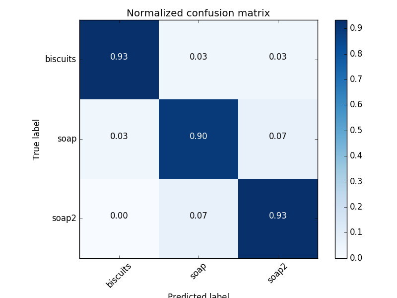
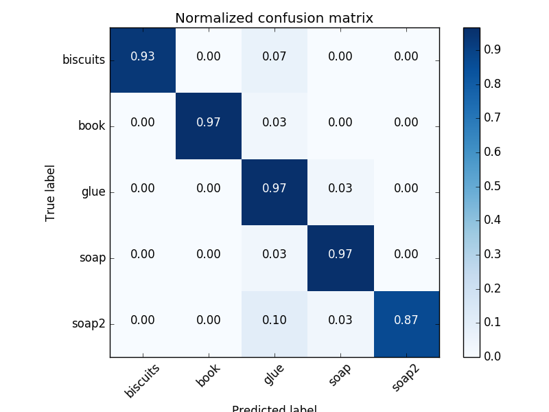
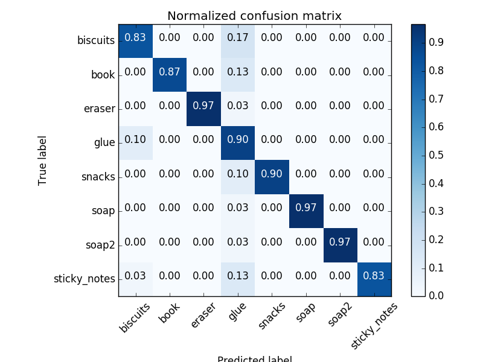
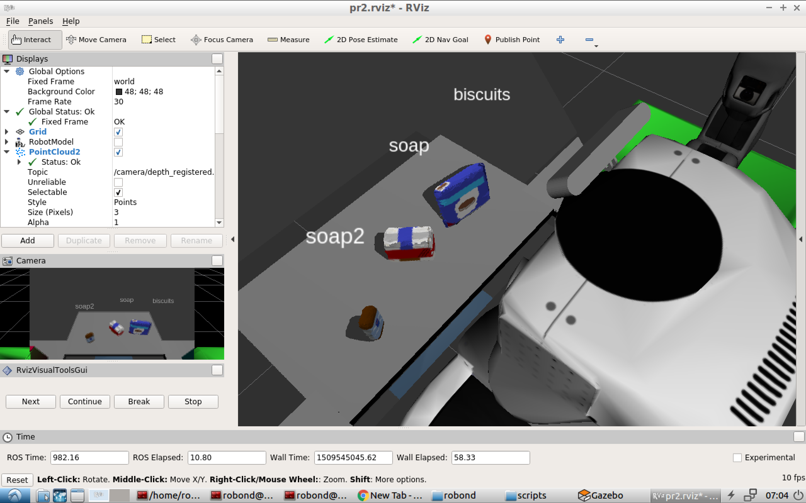
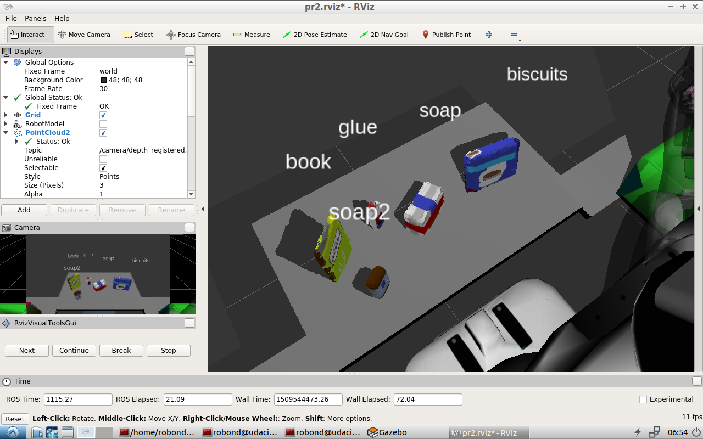
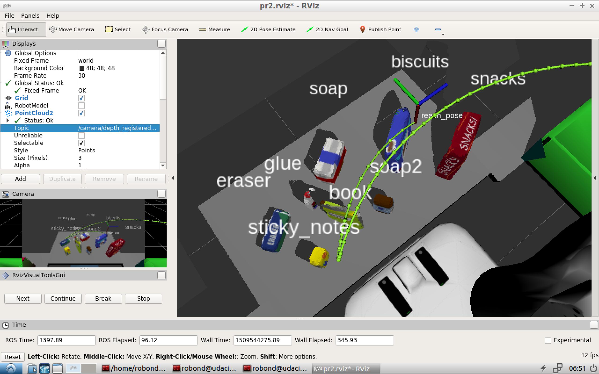

# Project: Perception Pick & Place

## Exercise 1, 2 and 3 Pipeline Implemented

RoboND-Perception-Exercises Repos is [here](https://github.com/msrks/RoboND-Perception-Exercises)

### 1. Complete Exercise 1 steps. Pipeline for filtering and RANSAC plane fitting implemented.

implemented!

### 2. Complete Exercise 2 steps: Pipeline including clustering for segmentation implemented.

implemented!

### 3. Complete Exercise 3 Steps. Features extracted and SVM trained. Object recognition implemented.

implemented!

I have 1) used HSV channel, 2) used RBF kernel for SVC, and 3) increased the number of captured features to improve confusion matrix.

confusion matrix is the following ..

#### world1

#### world2

#### world3

## Pick and Place Setup

### 1. For all three tabletop setups (test*.world), perform object recognition, then read in respective pick list (pick_list_*.yaml). Next construct the messages that would comprise a valid PickPlace request output them to .yaml format.

result is perfect!

#### world1

- [out1.yaml](out1.yaml)

#### world2

- [out2.yaml](out2.yaml)

#### world3

- [out3.yaml](out3.yaml)

#### Spend some time at the end to discuss your code, what techniques you used, what worked and why, where the implementation might fail and how you might improve it if you were going to pursue this project further.

captured point cloud is through the following pipeline.

1. filtered (VoxelGridDownsampling, StatisticalOutlier, PassThrough, RANSAC)
2. clusterd (DBSCAN)
3. reconized (SVC)
4. calculated centeroid

how to improve:

1. more dataset
2. other feature engineering & machine learning algorithm
3. Deep Learning (Segmentation Model!)
