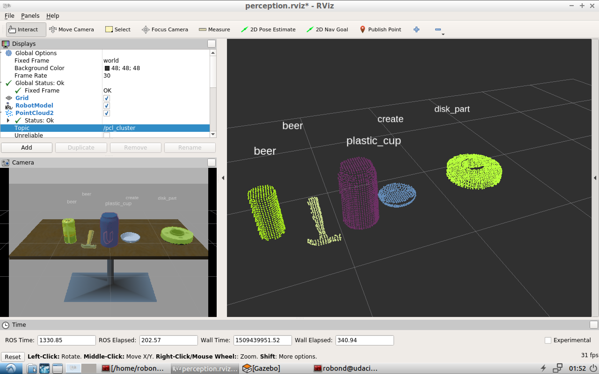

## 手順メモ

reinstall Python-PCL

```bash
$ cd ~/RoboND-Perception-Exercises/python-pcl
$ python setup.py build
$ sudo python setup.py install
```

create sensor_stick package

```bash
$ cd ~
$ git clone https://github.com/msrks/RoboND-Perception-Exercises.git
$ cp -r ~/RoboND-Perception-Exercises/Exercise-3/sensor_stick ~/catkin_ws/src/
$ cd ~/catkin_ws
$ rosdep install --from-paths src --ignore-src --rosdistro=kinetic -y
$ echo "export GAZEBO_MODEL_PATH=~/catkin_ws/src/sensor_stick/models" >> .bashrc
```

train svm

```bash
$ roslaunch sensor_stick training.launch
$ rosrun sensor_stick capture_features.py
$ rosrun sensor_stick train_svm.py
```

evaluate svm

```bash
$ roslaunch sensor_stick robot_spawn.launch
$ cd ~/catkin_ws/src/sensor_stick/scripts/
$ cp ~/catkin_ws/model.sav .
$ ./object_recognition.py
```

clone Perception Project

```bash
$ cd ~/catkin_ws/src
$ git clone https://github.com/msrks/RoboND-Perception-Project.git
$ rm -rf RoboND-Kinematics-Project/gazebo_grasp_plugin/
$ cd ~/catkin_ws
$ rosdep install --from-paths src --ignore-src --rosdistro=kinetic -y
$ catkin_make
$ echo "export GAZEBO_MODEL_PATH=~/catkin_ws/src/RoboND-Perception-Project/pr2_robot/models:$GAZEBO_MODEL_PATH" >> .bashrc
```

demo project

```bash
$ cd ~/catkin_ws/src/RoboND-Perception-Project/pr2_robot/scripts
$ chmod u+x pr2_safe_spawner.sh
$ ./pr2_safe_spawner.sh
```

retrain svm for project

```bash
$ roslaunch sensor_stick training.launch
$ cp ~/catkin_ws/src/RoboND-Perception-Project/pr2_robot/scripts/capture_features.py ~/catkin_ws/src/sensor_stick/scripts/capture_features_pr2.py
#edit models_list
$ nano ~/catkin_ws/src/sensor_stick/scripts/capture_features_pr2.py
$ rosrun sensor_stick capture_features.py
$ rosrun sensor_stick train_svm.py
```

modify training-set/world

```
- pick_place_project.launch 内の test*.world を変えることで worldを変えられる
- `capture_features.py` 内の modelsリストを `/pr2_robot/config/pick_list_*.yaml` に基づいて更新する
```

evaluate svm

```bash
#pr2_robot/launch/pick_place_project.launch を編集する
$ nano src/RoboND-Perception-Project/pr2_robot/launch/pick_place_project.launch
#(pick_list_*.yaml と test*.world を書換)
$ cp model_world1.sav src/RoboND-Perception-Project/pr2_robot/scripts/model.sav
#$ cp model_world2.sav src/RoboND-Perception-Project/pr2_robot/scripts/model.sav
#$ cp model_world3.sav src/RoboND-Perception-Project/pr2_robot/scripts/model.sav
$ roslaunch pr2_robot pick_place_project.launch
$ rosrun pr2_robot project_template.py
```


