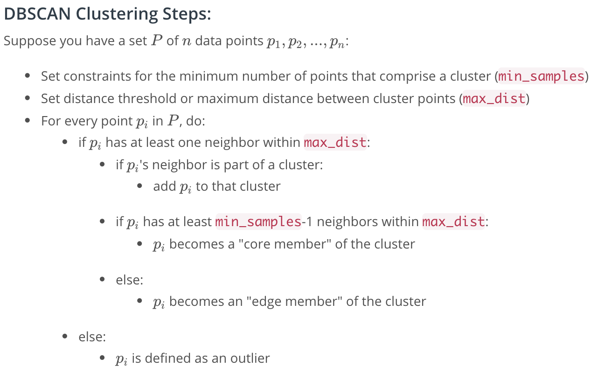

## 1. Calibration

- [github camera-caribration](https://github.com/msrks/RoboND-Camera-Calibration)

普通のカメラならいつも通りChessboardでやるやつ。ただしROS使うともっと簡単にできる

## 2. Filtering

- [github perception-exercise](https://github.com/msrks/RoboND-Perception-Exercises)

#### a) VoxelGrid Downsampling Filter：

- PointCloudデータを各VoxelGridに割り当てて、各VoxelGrid内の点を1点で近似する（平均値などで）

#### b) PassThrough Filter

- 興味ない領域を捨てる（Croppingする）Filter。ある軸方向に対して残す（PathThroughする）領域を選んでFilteringする。

#### c) RANSAC(Random sample consensus) Plane Fitting

- 事前に数理モデル（平面や円錐形など）を指定して、そのモデルでPoint Cloudデータに対してフィッティングをする
- この時、外れ値とされたものを除去する
- Iterativeなmethodで、最大回数を指定する必要がある
- d)ExtractIndices Filterと一緒に使う

#### d) ExtractIndices Filter

- RANSACの結果を使って、実際に外れ値を除去するFilter

#### e) Outlier Removal Filter

- ノイズ的な点を除去するフィルター
- 各点に対して近いN点を取ってきて、平均距離がThresholdより大きければ除去する

## 3. Segmentation

#### DBSCAN

>This algorithm is a nice alternative to k-means when you don' t know how many clusters to expect in your data, but you do know something about how the points should be clustered in terms of density (distance between points in a cluster).

## 4. Object Recognition

Featuresを `HSV Color Histogram` と `Surface Normal Histogram` で作り、SVCを学習する
